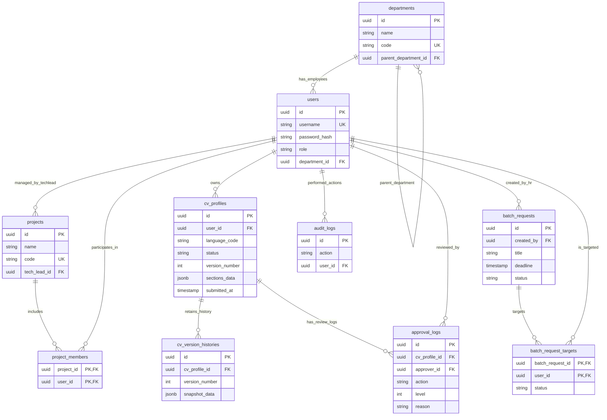

# Mô hình Thực thể Kết hợp (ERD)

Mô hình dữ liệu của hệ thống UmiCV.

## 1. Sơ đồ ERD (Mermaid)

## 2. Giải thích Quan hệ (Relationships)

### Identity & Access (Tổ chức & Phân quyền)
- **departments (1) - (N) departments**: Quan hệ tự tham chiếu (Self-referencing) để tạo sơ đồ tổ chức dạng cây (phòng ban cha/con).
- **departments (1) - (N) users**: Một phòng ban có nhiều nhân viên, một nhân viên chỉ thuộc biên chế một phòng ban chính thức.
- **users (1) - (N) projects**: Một Tech Lead (User) có thể chịu trách nhiệm chuyên môn duyệt CV cho nhiều dự án.
- **users (N) - (N) projects (thông qua project_members)**: Nhân sự có thể làm việc cross-function (chéo phòng ban) vào các dự án khác nhau. Tech Lead dự án dựa vào mapping này để có quyền lấy và duyệt CV của nhân sự.

### CV Management (Quản lý CV)
- **users (1) - (N) cv_profiles**: Mỗi nhân viên có nhiều bản CV (1 bản tiếng Việt, 1 bản tiếng Anh, 1 bản tiếng Nhật). Cardinality thực tế là tối đa 3 (do unique constraint `user_id, language_code`).
- **cv_profiles (1) - (N) cv_version_histories**: Mỗi khi nhân sự cập nhật CV và được duyệt thành công (publish), bản ghi hiện tại trong `cv_profiles` tăng version và dữ liệu jsonb được snapshot một bản lưu vào bảng history.

### Workflow & Approval (Quy trình & Phê duyệt)
- **cv_profiles (1) - (N) approval_logs**: Lưu lại toàn bộ lịch sử Approve/Reject của CV từ cả Tech Lead lẫn HR. Giúp truy vết lý do từ chối ở từng thời điểm.
- **users (1) - (N) approval_logs**: Người duyệt (Approver) để lại dấu vết.

### Batch Request (Cập nhật hàng loạt)
- **users (1) - (N) batch_requests**: Một HR có thể tạo nhiều chiến dịch yêu cầu cập nhật CV.
- **batch_requests (1) - (N) batch_request_targets**: Một chiến dịch yêu cầu nhắm tới nhiều nhân sự (tối đa 500 theo ADR-06). 
- **users (1) - (N) batch_request_targets**: Một nhân sự có thể nằm trong nhiều chiến dịch cập nhật (ví dụ chiến dịch định kỳ nửa năm, hoặc đợt chuẩn bị audit).
